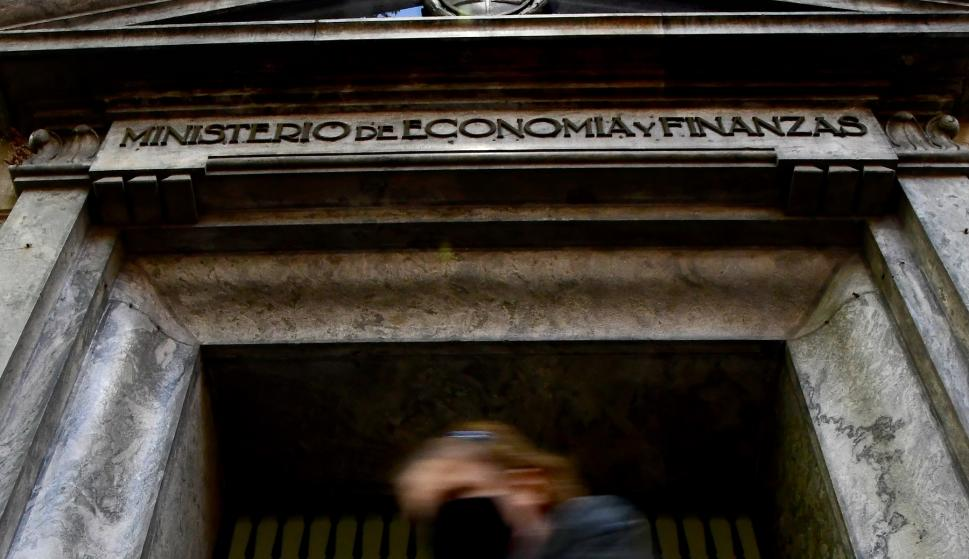

---
title: "Uruguay sin Grado Inversor: Las implicaciones de su pérdida"
excerpt: "¿Qué pasaría si Uruguay perdiera el Grado Inversor en su deuda soberana? Este artículo dará algunos lineamientos de sus posibles consecuencias "
date: 2019-08-10

show_post_time: false

author: "Diego Rijos"
location: "Montevideo, Uruguay"
draft: false
# layout options: single, single-sidebar
layout: single
categories:
  - El Observador
  - Academia Nacional de Economía
  - Deuda Soberana
tags:
  - Finanzas
  - Grado Inversor
  - Gestión de Deuda
links:
- icon: readme
  icon_pack: fab
  name: Link a la nota en El Observador
  url: https://www.elobservador.com.uy/nota/uruguay-sin-grado-inversor-lo-que-implica-la-posible-perdida-2019109215053
---

La pérdida del grado inversor es sin duda uno de los eventos que el próximo gobierno, independientemente del color de su bandera, deberá intentar evitar a toda costa. Mantenerlo no es solo un capricho de economistas, es una necesidad para toda la economía uruguaya y más en los tiempos que corren. 

La pregunta que surge es: ¿Realmente podemos perder el grado inversor? Actualmente Uruguay presenta ciertos indicadores que hacen pensar que la economía no pasa por un buen momento. Tenemos un déficit fiscal que ronda el 5% del PIB y que tiene miras de empeorar1. Una inflación que si bien es históricamente baja, es alta en comparación con países de Sudamérica (estamos por detrás de Argentina y Venezuela dentro de las economías con mayor inflación) y ni que hablar con los niveles de inflación del resto del mundo. Un sector privado con problemas de rentabilidad, que ha provocado tanto cierre de empresas como cambios en la localización de la producción hacia otros países. Consecuentemente con esto, Uruguay presenta un mercado laboral en franco deterioro y con bajo dinamismo, con un posible agravamiento dada la revolución tecnológica que se experimenta a nivel global2. A ello se agrega la devaluación argentina post PASO que afectará la temporada turística, además de ser contraproducente para las exportaciones a la vecina orilla, que sigue siendo uno de los principales mercados de exportación para los productos y servicios nacionales. Por otro lado, la no adopción de una regla fiscal que deja al libre albedrío del gobierno de turno el gasto público, generando en la mayoría de los casos inconsistencia temporal en las decisiones de gasto. Estos son algunos de los factores adversos a los que se enfrenta la economía uruguaya, y que nos acompañarán en el corto plazo, dependiendo de las medidas que se adopten en los próximos 12 meses para corregir los problemas macroeconómicos que nos afectan.

Cierto es que hay que ver la otra cara de la moneda. Se espera que la construcción de la segunda planta de UPM genere durante esa etapa, un aumento del PBI más intenso y, una contribución menor luego de finalizada la obra. El Tratado de Libre Comercio (TLC) entre el Mercosur y la Unión Europea (UE) es otro factor mitigante. Si bien en el corto plazo Uruguay al ser una economía más abierta respecto a sus pares del Mercosur, se beneficiará menos3 , el efecto del aumento de las exportaciones con preferencia arancelaria hacia el bloque europeo será un factor dinamizador para la economía. Las probabilidades de una recesión en Estados Unidos y las bajas de tasas de interés en los principales mercados, dan una ventana de acción para las economías emergentes, entre ellas la uruguaya, para optar por estrategias que mitiguen la probabilidad de que se reduzca su calificación de riesgo. 

Pasemos a analizar ahora algunas de las implicaciones de perder el grado inversor, que es lo que atañe a este artículo.

Una pérdida del grado inversor, se materializa en una suba en la tasa de interés a la que accede el país, al considerarse que existe un aumento en el riesgo de impago. Esto afecta la tasa de financiamiento a la que accede el estado, es decir que el monto de intereses que se va a tener que pagar por nuevas emisiones de deuda va a ser mayor. Ello agrava aun más el déficit fiscal de la economía. Además del aumento en la financiación del gobierno, la tasa de interés a la que acceden las empresas y los consumidores también va a aumentar como consecuencia de la pérdida del grado inversor. En una situación como la actual, un aumento en la tasa de financiamiento al sector privado puede devenir en mayores problemas de rentabilidad de los que ya enfrentan las empresas y una reducción adicional de consumo. 

Otra implicación es la pérdida que se generaría en los fondos previsionales de los trabajadores. Actualmente, por normativa del Banco Central del Uruguay, las AFAP se encuentran restringidas a invertir la mayoría del patrimonio de sus clientes en títulos uruguayos. Estos títulos sufrirán pérdidas en su valor actual, dependiendo en gran medida del plazo al que estén emitidos, dado que al aumentar su riesgo, la valoración de estos activos es menor. Este es un punto importante ya que las prestaciones que recibirán los nuevos pensionistas que se jubilen en esta posible coyuntura se verán afectadas negativamente.

Por otro lado la pérdida del grado inversor podría repercutir en una caída en el flujo de inversión extranjera directa. Dado que la pérdida puede ser un factor de señalización para el mercado sobre problemas macroeconómicos y políticos, lo que repercute en una caída de la confianza del inversor, haciendo que la localización de capital fijo sea menos probable. 

En el último informe de la calificadora Moody’s, la que nos mantuvo el grado inversor (Baa2) con perspectiva estable, luego del anuncio de la instalación de UMP y el TLC UE-MERCOSUR, se enfatizaba que se esperaba que dada la tradición de los actores políticos, se lograra llegar a consensos en materia fiscal y económica. S&P por su parte coincide con el análisis de Moody’s, en especial por la fortaleza del sistema institucional uruguayo. Por su parte Fitch califico con un BBB con perspectiva negativa, es decir en la frontera de perdida de grado. Las razones esgrimidas se acercan al análisis realizado en este artículo, problemas de control de déficit fiscal, inflación, entre otros. Este es un desafío que todo el sistema político debe enfrentar, no solo para mantener el grado inversor, sino por el futuro del país.

1 Ley de los cincuentones hará que el déficit actual del BPS aumente en el largo plazo, incrementando así el déficit fiscal, dado lo demás constante.
2 En especial con problemas relacionados a la productividad del trabajo y los niveles de capital humano, consecuencias claras de la divergencia del país con los postulados de la llamada “Economía del Conocimiento”. 
3 Debido a que la economía uruguaya (al igual que la paraguaya) es más abierta en términos relativos que Argentina y Brasil, es esperable que el efecto de la liberalización comercial sea menor, debido a que el impacto en el comercio que causará la baja de aranceles será menor que el que tendrán los socios más cerrados.

